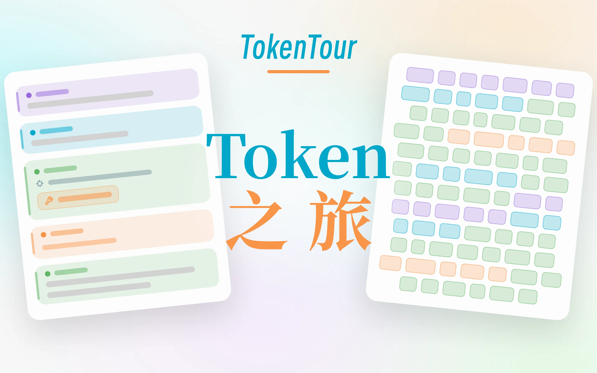

<p align="center">
  
</p>

<h1 align="center">TokenTour</h1>

<p align="center">
  Interactive notes and small labs for understanding how LLM applications are put together.
</p>

TokenTour is a web project about the parts of an LLM app that are usually hidden behind a chat box: messages, chat templates, tokenization, context windows, tool calls, and KV cache reuse.

The first module is **Chat to Token**. It has a long-form article and a playground that let you edit a conversation and watch the downstream representation update in real time.

The default language is English. Chinese versions are available from the language switch in the top-right corner.

## Current routes

| Route | Description |
| --- | --- |
| `/` | English home |
| `/zh` | Chinese home |
| `/chat2token` | English module hub |
| `/chat2token/zh` | Chinese module hub |
| `/chat2token/blog` | English interactive article |
| `/chat2token/blog/zh` | Chinese interactive article |
| `/chat2token/playground` | English playground |
| `/chat2token/playground/zh` | Chinese playground |
| `/design` | Internal design reference page |

## What is in the playground

The playground is a React app embedded in Astro. The left side is an editable chat state; the right side shows three synchronized views:

- **Chat Template** — renders the current messages through model-family templates such as Qwen3, DeepSeek-V3, and GPT-OSS.
- **Tokens** — tokenizes the rendered template text with real tokenizers where available, including built-in `gpt-tokenizer` encoders and local/HF tokenizer files.
- **Context × KV Cache** — estimates context usage, prefix reuse, and KV memory footprint from model architecture parameters.

Hovering a message or token highlights the corresponding region across panels. The demo mode works without an API key; BYOK mode can call OpenAI, Anthropic, DeepSeek, SiliconFlow, DashScope, OpenRouter, or any OpenAI-compatible endpoint.

API keys are stored in browser `localStorage`. If proxy mode is enabled, the key is attached by the browser request and forwarded by `/api/proxy`; the Worker does not persist it.

## Run locally

Use pnpm 10 or newer. The package manager version is pinned in `package.json`.

```bash
pnpm install
pnpm fetch-tokenizers
pnpm dev
```

Then open:

```text
http://localhost:4321
```

`pnpm fetch-tokenizers` downloads the tokenizer files used by the playground into `public/tokenizers/`. The site can still start without them, but some tokenizer choices will fall back or load remotely.

The `dev` script sets `TOKENTOUR_LOCAL_DEV=1`, which skips the Cloudflare adapter during local Astro dev. The Vite watcher also uses polling to avoid Linux `ENOSPC` watcher-limit errors in constrained environments.

## Build and deploy

The project is set up for Cloudflare Workers via `@astrojs/cloudflare`.

```bash
pnpm fetch-tokenizers
pnpm build
pnpm deploy
```

`pnpm deploy` runs:

```bash
astro build && wrangler deploy
```

Most pages are prerendered static output. The main server-side route is `/api/proxy`, used by BYOK proxy mode.

For local Worker preview:

```bash
pnpm build
pnpm preview
```

If you connect the repository to Cloudflare Workers Builds, use:

- Build command: `pnpm install && pnpm fetch-tokenizers && pnpm build`
- Deploy command: `pnpm exec wrangler deploy`
- Node.js: 22 or newer

## Project layout

The repository is split between the site shell and topic-specific code.

```text
src/
├── pages/                         # Astro routes
├── components/                    # Shared Astro components
├── layouts/
└── styles/

topics/chat2token/
├── app/                           # Playground React app
│   ├── App.tsx
│   ├── AgentChat.tsx
│   ├── LensChatTemplate.tsx
│   ├── LensTokens.tsx
│   ├── LensContextKv.tsx
│   ├── store/
│   └── lib/
├── blog/                          # Article content and embedded labs
│   ├── en/index.astro
│   ├── zh/index.astro
│   ├── BpeLab.astro
│   ├── PrefixCacheLab.astro
│   └── AttentionKvLab.astro
└── video/                         # Remotion source, not part of the website build path
```

`src/` owns routing, layout, and shared UI. Topic code lives under `topics/<topic>/` so new modules can be added without mixing their implementation with the site shell.

## Implementation notes

- Framework: Astro 6, React 19 islands, TypeScript, Tailwind v4.
- State: Zustand with selected fields persisted to `localStorage`.
- Chat templates: Jinja templates rendered with `@huggingface/jinja`.
- Tokenizers: `gpt-tokenizer` for built-in encoders, plus local/HF tokenizer assets for Qwen3 and DeepSeek-V3.
- Streaming: native `fetch` and SSE-style provider adapters.
- KV cache visualization: token-prefix diffing plus architecture metadata from `modelRegistry.ts`.
- Design: shared color/type/layout tokens live in `src/styles/design.css`.

## What is approximate

The visualizations are meant to be inspectable and internally consistent, but they are not a full inference engine.

- KV memory numbers are computed from model architecture parameters, but individual grid cells are a visualization of state, not real activations.
- Prefix reuse is computed by comparing the current token sequence against a frozen local baseline. It shows what is reusable in principle; it does not confirm whether a provider-side prompt cache was actually hit.
- Only a small set of tokenizers is bundled. Unknown model/tokenizer combinations may fall back to a nearby built-in tokenizer.

## More details

For a tour of the playground UI, see [docs/GUIDE.md](./docs/GUIDE.md).
