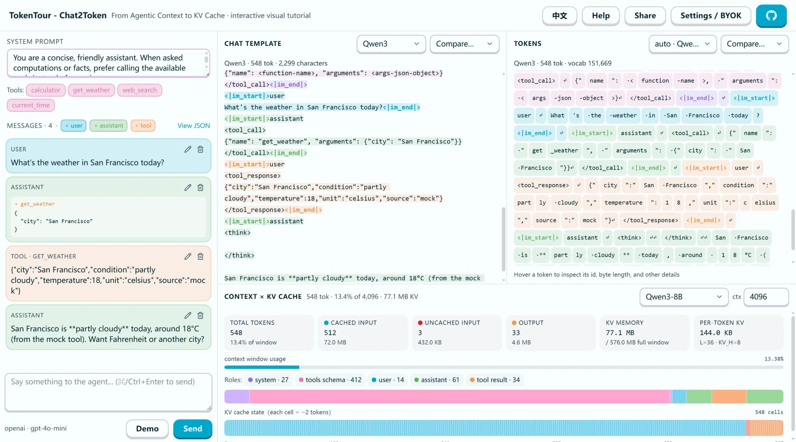

  <a href="./README.md">English</a>

  

<h1 align="center">TokenTour</h1>

  对 LLM 应用技术栈做一次纵向解剖——从 Agent 消息一直看到 Token 与 KV Cache。

  <a href="https://tokentour.flwfdd.xyz/chat2token/zh">阅读交互文章</a> ·
  <a href="https://tokentour.flwfdd.xyz/chat2token/playground/zh">打开 Playground</a>

LLM 应用从外面看起来很简单，但一次对话实际会经过许多层：Agent 消息、Chat Template、分词、上下文窗口、注意力和 KV Cache。每一层都有自己的表示方式，它们之间的联系很容易被层层封装遮住。

TokenTour 希望对这套技术栈做一次**纵向解剖**。我们不孤立地解释某一层，而是沿着同一段对话一路向下，展示一个变化如何穿过各层并影响最终送入模型的内容。

第一个交互主题 **Chat to Token** 由引导式文章和同步 Playground 组成。你可以修改一段对话，观察它如何变成模型输入、如何被切成 Token，以及它会怎样影响上下文占用和 KV Cache 复用。

  

## 可以探索什么

- **消息 → Chat Template**：比较 Qwen3、DeepSeek-V3、GPT-OSS 等模型家族如何序列化同一段对话和工具调用。
- **文本 → Token**：查看 Token 边界、字节级行为，以及细微修改如何改变整个序列。
- **Token → 上下文与 KV Cache**：理解因果注意力、估算 KV 显存，并查看下一轮可能复用哪些前缀。
- **跨层追踪**：悬停或选中一个元素，在多个同步视图中找到与它对应的区域。

Playground 内置了准备好的 Agent 运行轨迹，无需 API Key 即可体验。你也可以使用自己的服务商和 Key，在浏览器中生成新的轨迹。Key 只保存在本地浏览器中，TokenTour 不会持久化存储。

## 展示边界

TokenTour 是解释模型，而不是推理引擎。在条件允许时，分词使用真实的模型 Tokenizer；KV 显存则根据模型架构参数计算。注意力单元格和前缀缓存状态用于解释机制，不代表服务商遥测数据或模型的真实激活值。

网站默认显示英文，可通过右上角的语言按钮切换为中文。

本地开发、部署和实现说明见[开发文档](./docs/DEVELOPMENT.md)，Playground 的详细使用方法见[操作指南](./docs/GUIDE.md)。
